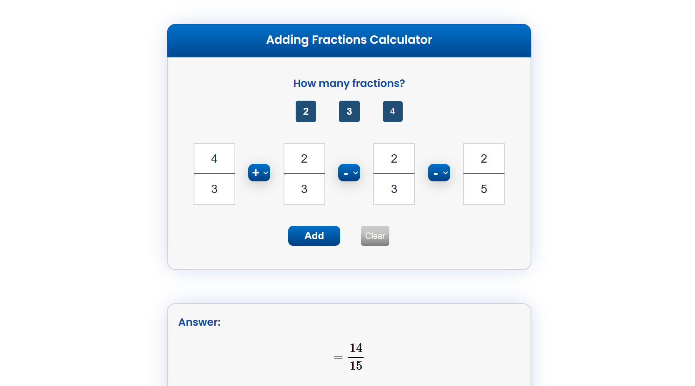

# Adding fractions calculators

This calculator adds up to four fractions and shows a step-by-step solution. 

## Table of contents

- [Overview](#overview)
  - [Instructions](#instructions)
  - [Screenshot](#screenshot)
  - [Links](#links)
- [My process](#my-process)
  - [Built with](#built-with)
- [Author](#author)


## Overview

## Instructions
1. This app requires [MathJax](https://www.mathjax.org/#gettingstarted) to render LaTeX

2. The number of fractions to be added can be selected using the buttons.

3. The final solution will be displayed on the "Answer" box and the step-by-step solution will be displayed on the box underneath.  

4. MathJax.typeset was used to render the solution using LaTeX: 

```js
MathJax.typeset();
```

### Screenshot



### Links

- Live Site URL: [https://jefferh30.github.io/Adding-fractions-calculator-step-by-step-/](https://jefferh30.github.io/Adding-fractions-calculator-step-by-step-/)

## My process

### Built with

- Semantic HTML5 markup
- CSS custom properties
- Simple JavaScript
- MathJax

## Author

- Website - [Jefferson Huera](https://www.neurochispas.com)
